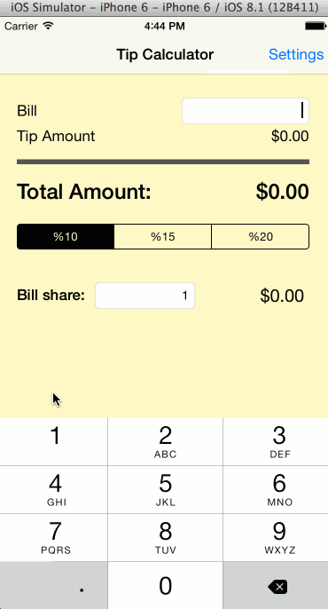

# TipCalculator
CodePath iOS Intro Class - HW#1 Tip Calculator

This is the CodePath iOS Intro Class Pre-Assignment to create a simple Tip Calculator

Time Spent:

Completed user stories:
 * [x] Required: Follow walkthrough to create TipCalculator Application
 * [x] Required: Augment TipCalculator to include Settings
 * [] Optional: Modify UI

Notes:

Walkthrough of all user stories:

GIF created with [LiceCap](http://www.cockos.com/licecap/).
